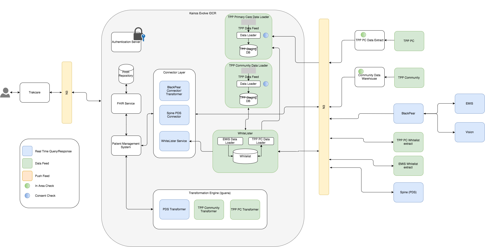

# Implementation of interface to [healthcare gateway's](http://healthcaregateway.co.uk/) medical information gateway

## Introduction
As of 06/10/2017 the decision has been made to use healthcare gateway's Medical Information Gateway (MIG) to retrieve 
patient information from EMIS and Vision. MIG provides a [SOAP](https://en.wikipedia.org/wiki/SOAP) based interface to retrieve 
patient medical records. It primarily acts as a proxy between the client application and the data source (EMIS or Vision).

## Detail

The following diagram illustrates the overall architecture of the system:

Thus primary reason for the JUYI project is to retrieve medical information from remote systems. Three mechanisms are 
used to achieve this: Real time queries, data feeds and push feeds. The MIG interface provides a real time interface to 
EMIS and Vision.

The product team have implemented an integration engine which is responsible for initiating calls to both internal
and external data sources. An ODP for the [integration engine](https://kainos-evolve.atlassian.net/wiki/spaces/STG/pages/112464040/ODP+10+-+Integration+Services+-+separate+delivery+from+product)
has been created and reviewed.

In agreement with the product team a connector service has been created that handles calls to outgoing systems and, when
required, transforms the data returned into [FHIR](http://hl7.org/fhir/index.html), the standard data format of the Evolve product.
The connector framework uses [dropwizard](http://www.dropwizard.io/1.2.0/docs/) to implement a web service through which 
all external requests are made.

### MIG Implementation Detail

The following diagram illustrates the sequence of messages passed between JUYI and the MIG:

### EMIS vs Vision responses

### Concurrent requests

### XML parsing

### Database lookups

## Summary

### Technical risks in the solution